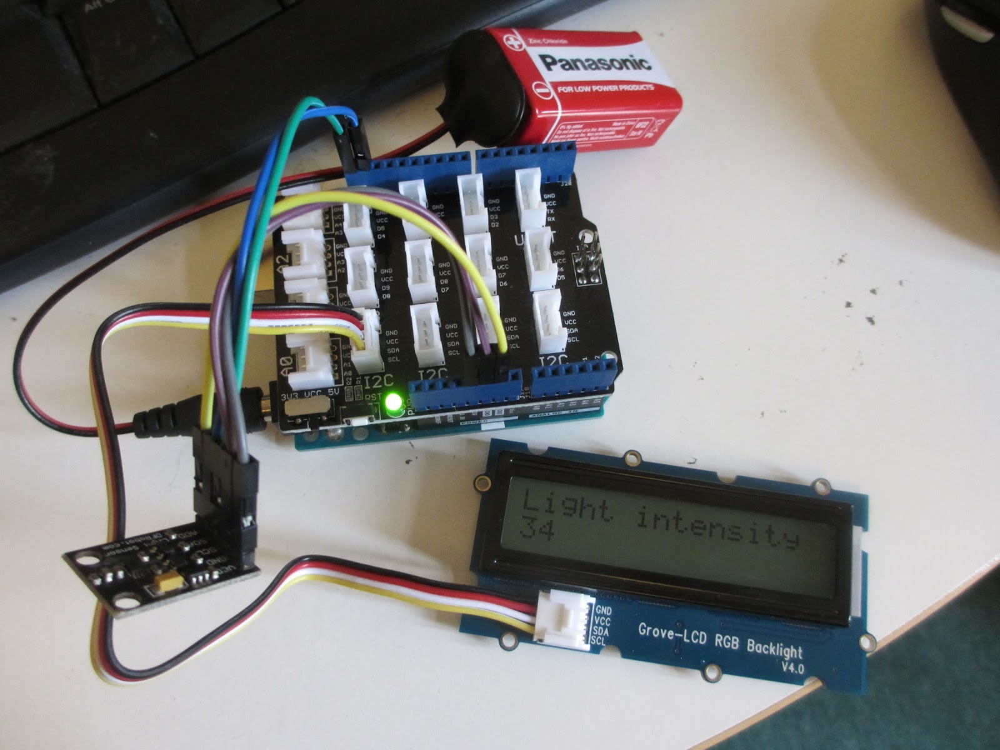
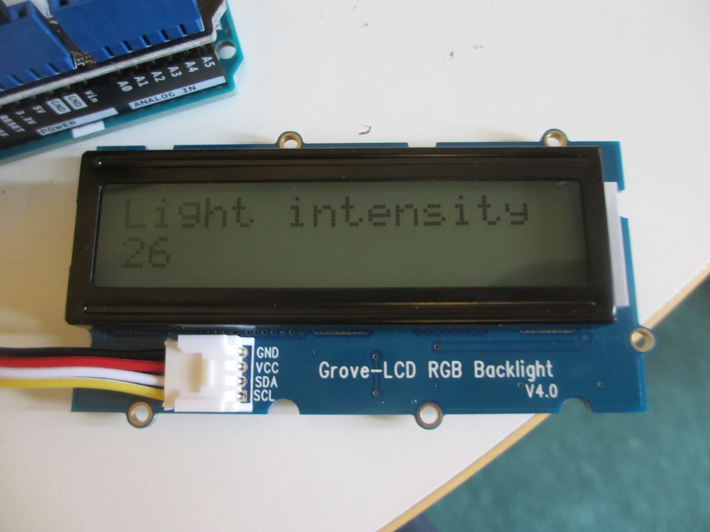
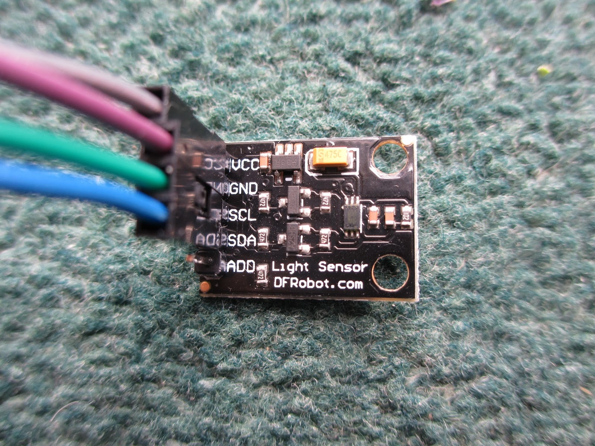
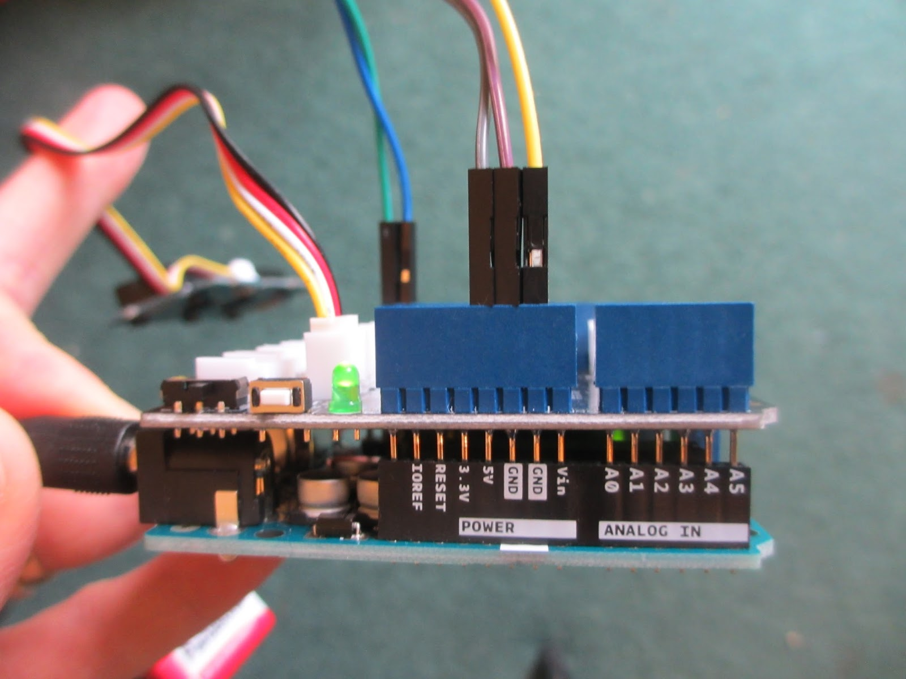
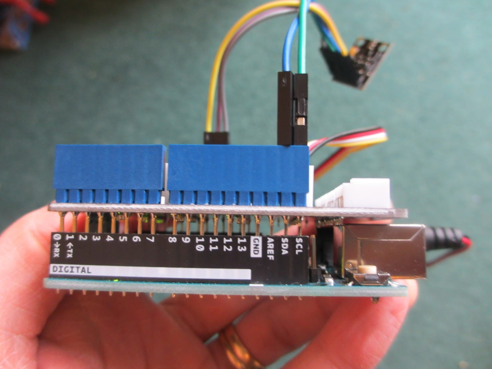
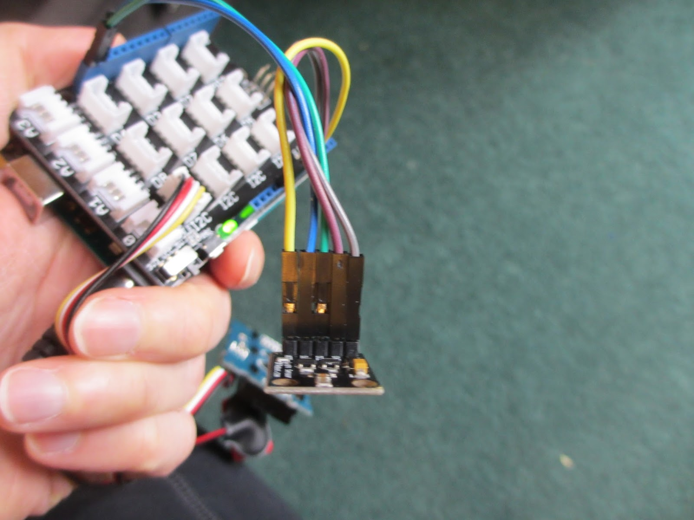

## Synopsis

My aim in this project is to enable teenage (and other) gardeners to consider how the growing conditions in their gardens compare with those of the TV gardens shown in Gardeners' World and the Beechgrove Garden. Teenage gardens are a group that horticulturalists and the gardening media are particularly keen to engage at the moment, and I hope that this project will help with that. 

For young gardeners it can be frustrating to see perfect tv gardens and to be unclear about what the difference between those tv gardens and the home gardens actually are. In fact their are many differences, such as the fertiliser and water content of the soil, the temperature and length of growing season in different geographical areas, the depth of soil, and the domninance of certain pests, such as aphids, pigeons and even deer. 

However, one difference that is really hard to quantify is light intensity. This is particularly difficult to grasp as the human eye is especially good at compensating for differences in light intensity. This is done by dilating the pupil of the eye by exactly the correct amount to make the current brightness of light seem just right. 

The accommodation of the human eye means that we are often unaware that we may be in really very dim, or very bright light. It also makes it hard to spot that a house plant might be really struggling to capture adequate light, while another plant just outside an adjacent window may be struggling with excess light, causing breakdown of the photosystems in its leaves. 

The horticultural industry contributes to this lack of clarity by simply taking about "shade", "full sun", and "partial shade" without giving any more clarity about exactly what this means in any standard unit of light intensity. It generally talks about the number of hours of full sun received, but my intuition is that 6 hours of full sun would be a very different thing in Orkney, from 6 hours of full sun received in Kent, especially during the winter. 

The light meter construction shown here, attempts to address this problem somewhat by allowing people to consider their own gardening and light conditions. The light meter is made from standard, easily bought parts. I have chosen the parts because the are cheap and easy to put together, the light sensor detects the correct range of light intensity, and the code is very easy to use and debug. 

My hope is that this how-to could be published by a gardening magazine like Gardeners' World Magazine, and that it could encourage many young gardeners to build their own light meter and measure the light conditions that are underpinning or undermining their growing success.

I would love to see this project published as a citizen-science project in which people who do build the light meter could then report their gardening light conditions on a website and that the information could be collated and the reported back in a later issue. This would help people to test whether the brightest spot in a garden in one area of the country might have the same sort of light intensity as the shadiest spot in a garden in another part of the country. This kind of information would help people to choose appropriate plants for their gardens, and to modify the conditions of growth, if they need to. 

I anticipate that the understanding of light conditions that this article brings would also be very instructive for those who have health problems that are conspicuously better in summer and worse in winter. I hope that this new knowledge would help people to make more informed choices about how much time they spend in the garden to support their winter health, and at what period of the day they do their gardening, for the best effect. The light meter might, in effect, become a low cost bio-wearable device to help people gauge how much sunshine they have had on any given day in winter, enabling them to optimise their winter sun exposure. 
  

I anticipate that before publishing the article it would be helpful to negotiate a good price for the complete kit that is needed and that an order form could be included with the article so that readers could order the necessary parts very easily. 

This project could perhaps be followed up by further adrunio-based projects to measure temperature and other factors in plant growth.

The kind of results that might be found are explained helpfully in this document: http://www.ccfg.org.uk/conferences/downloads/P_Burgess.pdf.

One caveat to this project is that this equipment is not especially novel. Similar devices such as the <a href="https://www.pat-services.co.uk/testsafe-tslm2-adjustable-luxmeter?fee=5&fep=5851&gclid=Cj0KCQjwh_bLBRDeARIsAH4ZYEPwgCyxVciVubU4TPqzuEtPfkPFkvByPuxwsUEBxVCNk5Irfa1_NzkaAitJEALw_wcB"> TSLM2 Adjustable Digital Luxmeter</a> can be bought slightly more cheaply. The attraction of this project is that it introduces teenagers to electronics, programming, a certain amount of physics, and an understanding of horticulture, with a lot of fun thrown in. 

## Software

#include <Wire.h> 
#include <BH1750.h> 
#include "rgb_lcd.h" 
  

rgb_lcd lcd; 
const int colorR = 0; 
const int colorG = 0; 
const int colorB = 0; 

BH1750 lightMeter; 

void setup() { 
  Serial.begin(9600); 
  lightMeter.begin(); 
  Serial.println("Running..."); 
  // set up the LCD's number of columns and rows: 
  lcd.begin(16, 2); 
  lcd.setRGB(colorR, colorG, colorB); 
  // Print a message to the LCD. 
  lcd.print("Light intensity"); 
} 
  

void loop() { 
  uint16_t lux = lightMeter.readLightLevel(); 
  Serial.print("Light: "); 
  Serial.print(lux); 
  Serial.println(" lx"); 

  // Clear the bottom line of the LCD 
  lcd.setCursor(0,1); 
  lcd.print("          "); 

  // For LCD: set the cursor to column 0, line 1 
  // (note: line 1 is the second row, since counting begins with 0): 
  lcd.setCursor(0, 1); 
  // print the number of seconds since reset: 
  lcd.print(lux); 
  delay(1000); 
} 

  
## Hardware

Explain how the hardware components (if any) of your project function as concisely as possible, including a short description of fabrication and assembly. Component suppliers and part numbers should be provided separately in a bill of materials, in a 'Hardware Folder'.

Notes on hardware to be moved to the Hardware folder:

- <a href="https://www.amazon.co.uk/d/Electronics-Photo/40pcs-Dupont-Male-Female-20cm-Jumper-Connectors/B013EW65H2/ref=sr_1_1?ie=UTF8&qid=1501469205&sr=8-1&keywords=male+to+female+jumper+leads"> 5 jumper leads, male to female</a> - £1.99+P&P 
- <a href="https://makersify.com/products/dfrobot-light-sensor-bh1750">one light sensor BH1750</a> - £14+P&P 
- <a href="https://www.amazon.co.uk/Arduino-A000066-UNO/dp/B008GRTSV6/ref=sr_1_4?s=computers&ie=UTF8&qid=1501468175&sr=1-4&keywords=arduino+uno">One arduino Uno</a> - £17.30+P&P 
- <a href="https://www.seeedstudio.com/Grove-LCD-RGB-Backlight-p-1643.html">One Grove-LCD RGB Backlight v4.0</a> - £10.61+P&P 
- <a href="http://www.robotshop.com/uk/adafruit-battery-holder-barrel-jack.html?gclid=Cj0KCQjwlMXMBRC1ARIsAKKGuwgjdagw_J_4zrTdrNKmqMNNupCF1OF1kEguYkfuQn4ah6_1nsIECt8aApqwEALw_wcB">Battery holder + wire to power the Arduino.</a> AA batteries ideal as rechargables are easy to obtain. 6 x AA batteries are needed to give 9V. Four AAs is not enough to power the screen - £4.66+P&P 

  
The light sensor measures from 0 to 100,000 lux, which is a very good range for measuring from the darkest room in a house to the brightest day outside.   

Here are some initial images of the hardware. These will be replaced with better ones once the images are ready.

## Installation, Maintenance and Testing Guide

Using the machine is very easy. Just plug it all togehter. Plug into the computer with the Arduino's usb cable. Run the arduino software and past the code above into the code window. Then press the button (top left) to upload the code to the Arduino. Then unplud from the computer and plug in the battery and walk outside. The machine should automatically start displaying the light intensity on the lcd screen. The table below gives some example readings. 

## Some light meter readings

### August

14th August, 3.20pm 21 degrees C, in my own garden;

| location | light intensity in lux  |
| --------- | ------------------------ |
| dining room, 2m from french windows that face east, doors open      |    360 |
| same location but with me between the sensor and door, casting shade, doors open   |       79 |
| almost same location but now sitting 1m from open door     |    3000 |
| sitting on the step of the french windows, sensor facing up    |     8000 |
| same location, sensor facing down       |  2000 |
| out in the garden, sensor facing up, 70% thin cloud     |    20000 |
| same, but with a piece of paper held 15cm above to shade sensor  |     9300 |
| under the pear tree     |    5000 |
| in greenhouse    | 7200 |
| under a pumpkin leaf 2m from greenhouse  |   2000 |
| next to the pumpkin leaf    |      11600 |

## License

i have no idea what to do with this bit. 
